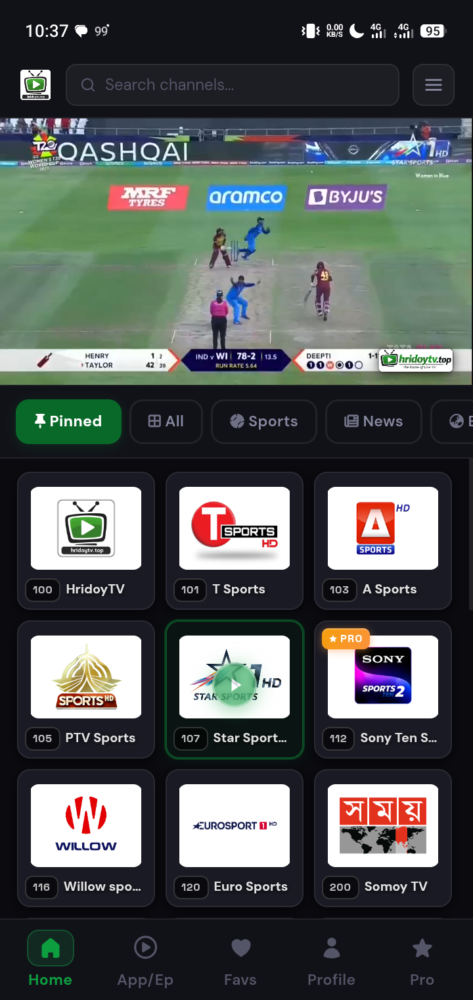

📺 HridoyTV — The Home of Live TV

  
  

HridoyTV V1.0 (Latest)

🔗 Quick Links

  🌐 <a href="https://hridoytv.top"><strong>Visit Website</strong></a>
  &nbsp;&nbsp;•&nbsp;&nbsp;
  📥 <a href="https://github.com/hossainhridoyx/HridoyTV/raw/refs/heads/main/HridoyTV%201.0.apk"><strong>Download APK</strong></a>

HridoyTV is a modern and user-friendly live television streaming platform that lets you watch your favorite TV channels anytime, anywhere. Designed for speed, simplicity, and convenience, HridoyTV brings live entertainment directly to your device.

✨ Features

📡 Watch Live TV

Stream popular local and international TV channels in real time.

🔓 Free & Pro Channels

Enjoy a collection of free channels available to everyone, with access to exclusive premium channels for Pro members.

🎨 Clean & Simple Interface

A modern, lightweight, and easy-to-use design that provides a smooth viewing experience.

📱 Multi-Device Support

Watch seamlessly across smartphones, smart tv, tablets, laptops, and desktop devices.

🔐 Easy Authentication

Sign in using Google or Email to securely save your profile, preferences, and viewing experience.

🚀 Why HridoyTV?

- Fast and reliable streaming
- Modern responsive design
- Secure user authentication
- Easy channel access
- Works across multiple devices

---

HridoyTV — Your Entertainment, Anywhere.

© HridoyTV.top 2025–2026. All Rights Reserved.
