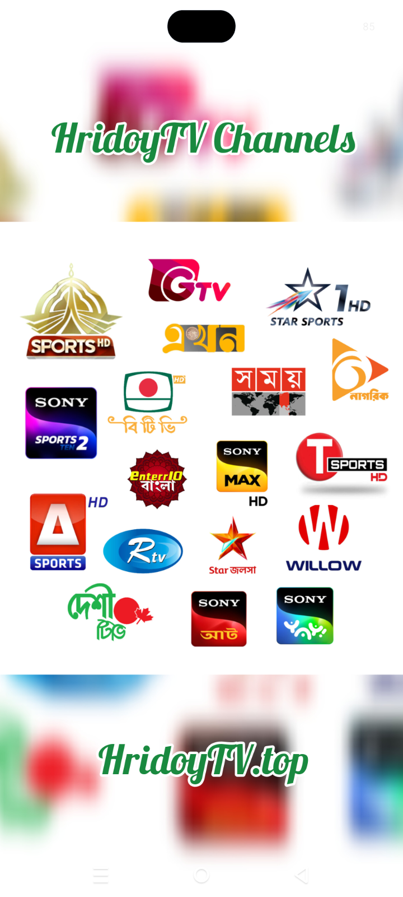

# 📺 HridoyTV — The Home of Live TV

  

  
  

<strong>HridoyTV V1.0 (Latest)</strong>

---

### 🔗 Quick Links

* 🌐 **Official Website:** [hridoytv.top](https://hridoytv.top)
* 📱 **Mobile App:** [Download Mobile APK](https://github.com/hossainhridoyx/HridoyTV/raw/refs/heads/main/HridoyTV%201.0.apk)
* web: [hridoytv.pages.dev](hridoytv.pages.dev)
* 📺 **Android TV App:** [Download Android TV APK](https://github.com/hossainhridoyx/HridoyTV/raw/refs/heads/main/HridoyTV%20Live%201.0.apk)
* web: [hridoytvlive.pages.dev](hridoytvlive.pages.dev)

---

### ✨ Features

📡 **Watch Live TV**
Stream popular local and international TV channels in real time.

🔓 **100% Free Premium Channels**
Enjoy unrestricted access to all channels, including premium content, completely free of cost. No subscription or pro membership required.

🚫 **No Login Required**
Skip the hassle of registration. No sign-up, email, or Google authentication needed—just open the app and start streaming instantly.

🎨 **Clean & Simple Interface**
A modern, lightweight, and easy-to-use design that provides a smooth viewing experience.

📺 **Dedicated Android TV App**
Enjoy a seamless big-screen experience with our brand-new, fully optimized app designed specifically for Android TV and smart TV boxes.

📱 **Multi-Device Support**
Watch seamlessly across smartphones, smart TVs, tablets, laptops, and desktop devices.

---

### 🚀 Why HridoyTV?

- Fast and reliable streaming
- Modern responsive design
- Dedicated Android TV support
- Completely free with no account required
- Instant channel access
- Works across multiple devices

---

HridoyTV — Your Entertainment, Anywhere.

© HridoyTV.top 2025–2026. All Rights Reserved.
