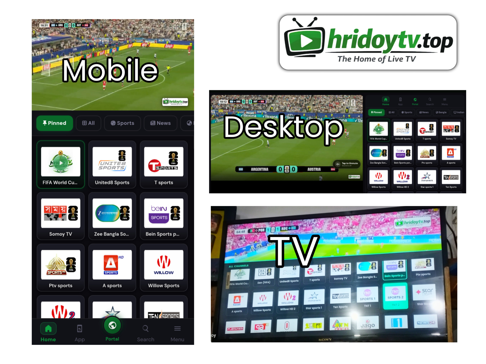

# 📺 HridoyTV — The Home of Live TV

  

  <strong>📱 For Android Mobile + PC (Emulator): HridoyTV v1.2</strong> 
  <strong>📺 For Smart TV: HridoyTV Live v1.1</strong>

---

## 🔗 Quick Links

- 🌐 **HridoyTV portal:** [hridoytv.top](https://hridoytv.top)
- 📱🖥️ **Mobile+PC (Emulator) App:** [Download App](https://github.com/hossainhridoyx/HridoyTV/releases/download/v1.2/HridoyTV.v1.2.apk)
- 🌐 **Website:** [hridoytv.pages.dev](https://hridoytv.pages.dev)
- 📺 **Smart TV App:** [Download TV App](https://raw.githubusercontent.com/hossainhridoyx/HridoyTV/main/New%20HridoyTV%20App/HridoyTV%20Live%201.1.apk)
- 🌐 **Website:** [hridoytvlive.pages.dev](https://hridoytvlive.pages.dev)

---

## ✨ Features

- 📡 Watch 200+ local & international live TV channels.
- 🔓 100% Free access, including premium channels.
- 🚫 No login or registration required.
- 🎨 Clean, modern, and user-friendly interface.
- 📺 Dedicated Android TV app.
- 📱 Supports Android phones, tablets, PC (Android Emulator), and Android TV.
- ⚡ Fast, smooth, and reliable streaming.

---

## 🚀 Why HridoyTV?

- Fast & reliable streaming
- 200+ Live TV channels
- Modern responsive interface
- Dedicated Android TV support
- No account required
- Works across multiple devices

---

## 📦 Latest Versions

| Platform | Version |
|----------|---------|
| 📱 Android Mobile + PC (Emulator) | **HridoyTV v1.2** |
| 📺 Android Smart TV | **HridoyTV Live v1.1** |

---

**HridoyTV — Your Entertainment, Anywhere.**

© HridoyTV.top 2025–2026. All Rights Reserved.
